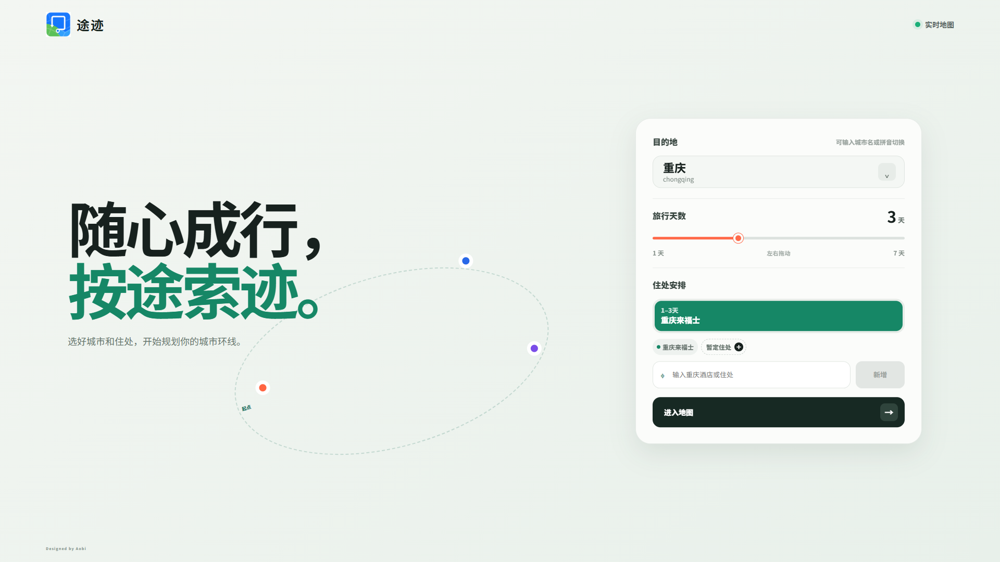
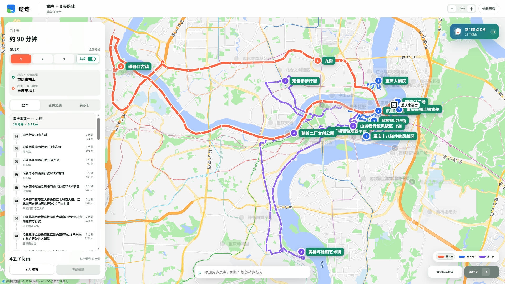
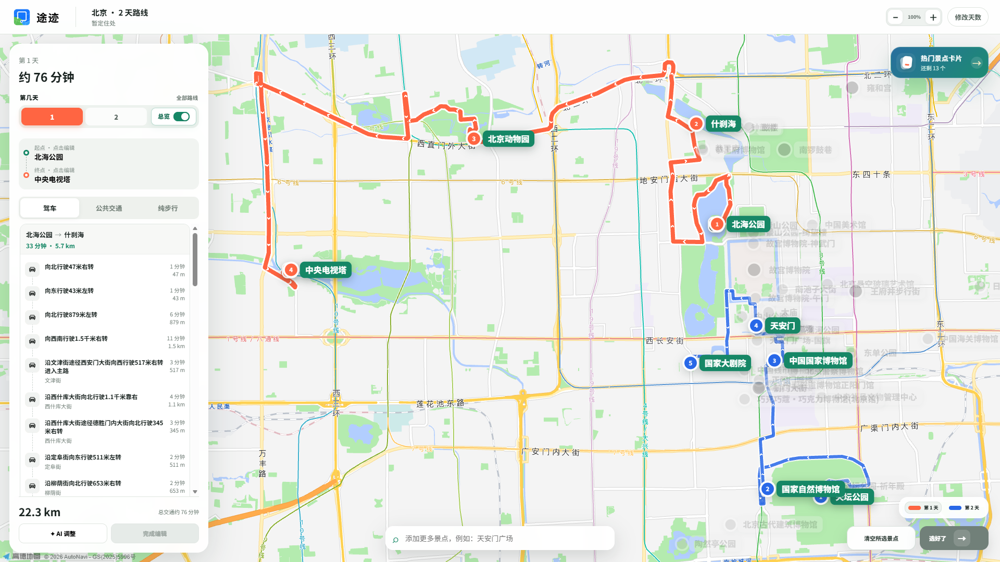
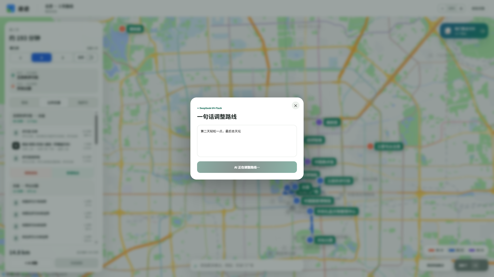

<div align="center">
  
</div>

# 途迹 TujiMap

_基于真实地图与可解释启发式算法的城市多日旅行路线规划工具。_

[](CHANGELOG.md) [](https://react.dev/) [](https://www.typescriptlang.org/) [](LICENSE)

**随心成行，按途索迹。** 途迹把“发现景点、筛选景点、安排天数、生成真实导航”整合到同一张地图中，帮助用户得到少折返、可理解、可继续编辑的城市游览方案。

[在线体验](https://tujimap.aobi.qzz.io/) · [更新日志](CHANGELOG.md) · [项目仓库](https://github.com/AOBI8001/TujiMap)

---

## 📋 项目概览

传统旅行规划通常被拆散在内容平台、收藏列表和地图软件之间：用户先搜攻略，再逐个收藏，最后手动判断景点距离、分配每天行程，并反复调整导航顺序。普通地图擅长计算两个地点之间的路径，却不会主动解决“多个景点如何分天、如何少走回头路、返程能否继续游览”等城市旅行问题。

途迹聚焦三个核心需求：

- **降低选点成本**：在真实地图上展示中心城区景点，同时提供有限数量的热门卡片用于快速筛选
- **减少空间折返**：先按地理连续性分天，再优化每天的访问顺序，避免把相距较远的片区混在同一天
- **保留用户控制**：路线生成后仍可增删途中地点、编辑起终点、切换交通方式，或用自然语言调整安排

当前版本覆盖 100 个国内城市，支持 1–7 天行程、多个住处、开放路线与闭合路线，并提供驾车、公共交通和纯步行三种真实道路导航。

首页提供「自由选择」与「图片识别」两种入口。图片识别可将攻略截图或手绘地图中的地点转换为可核对的地点清单，减少反复抄写、搜索景点的操作。

## 🎯 产品设计

### 选择与规划分离

用户在地图、搜索框或热门卡片中选择景点时，途迹只更新草稿状态，不立即请求路线。只有点击“选好了”或完成路线编辑后，系统才统一计算。这避免了每勾选一个地点就刷新地图和消耗接口配额，也让用户在提交前保持完整的选择自由。

### 地图优先的信息层级

地图承担主要信息展示：未选择的景点保留可见但降低视觉权重，已选择地点使用分日颜色和序号突出。桌面端使用固定导航侧栏，移动端使用可展开的全屏导航抽屉，确保路线细节不会长期遮挡地图。

### 图片识别与地点校验

图片入口支持点击或拖拽上传单张 JPG、PNG、WebP。图片在浏览器中缩放并重新编码，点击识别后交给 DeepSeek 提取单个城市内的地点，不让模型生成经纬度或道路路线。旅行天数由用户选择，不从图片推断。

识别分为两个阶段：先提取路线标签及正文明确推荐的地点，再结合原图核验候选，补充遗漏并移除背景地名、泛称、重复项等。第二阶段使用增删差量保留未被否定的候选，减少整份重写造成的遗漏。服务端统一校验结构、规范化名称并去重，最多保留 40 个地点；两次模型请求共享 40 秒超时预算，不无限重试。

识别后只需选择天数并勾选地点，点击「确认并规划」即进入地图。系统自动匹配真实地点，并显示定位进度；精确同名或规范化名称唯一匹配的候选自动采用，无法定位或有歧义的地点才需要补充确认，不静默丢弃或随意采用第一个结果。匹配搜索使用两个工作槽并复用高德限速网关。确认后的真实地点送入已有分天、顺序优化和三模式导航流程。

当前图片入口按单个城市规划，不导入酒店住处；城市不明确时需要手动选择。模糊文字、同名地点及重复景区仍需人工核对，识图结果不等同于无误的地理数据。应用不持久化上传图片或将其用于训练，模型服务商的数据处理遵循其服务条款。

### 开放路线与闭合路线

- 未设置住处时，不虚构固定起终点；系统把选中的景点排成从第一个游览点到最后一个游览点的单向开放路线
- 设置住处后，每天以对应住处作为起点和终点，形成适合当日往返的闭合路线
- 多住处按天切分，每一天使用所属住处独立规划

## 📚 产品预览

<table>
  <tr>
    <td width="50%"><br /><sub>城市、旅行天数与多住处安排</sub></td>
    <td width="50%"><br /><sub>分日路线总览与逐段真实导航</sub></td>
  </tr>
  <tr>
    <td width="50%"><br /><sub>未设置住处时生成开放路线</sub></td>
    <td width="50%"><br /><sub>用自然语言直接修改已有安排</sub></td>
  </tr>
</table>

## ⚙️ 路线算法

途迹负责景点候选、同景区去重、分天与访问顺序；高德开放平台负责真实道路折线、公交换乘、距离与耗时。[^1]


### 1. 候选景点与热度筛选

城市目录提供 100 个可选城市，其中北京、上海、广州、成都、重庆和贵阳包含人工整理的中心城区基线数据；其他城市进入地图后由高德地点服务补齐真实候选。系统按城市等级设置约 18–24 km 的中心城区半径，减少远郊景点混入城市日游路线。

热门卡片先按内部热度和高德评分排序，再根据城市热度动态选择 8–20 个候选，不要求所有城市拥有相同数量。地图仍可展示更多中等热门景点，因此“卡片数量”和“地图地点数量”彼此独立。

### 2. 同景区去重

景点名称会先去除空格、标点和“景区、博物馆、公园、入口、东门”等常见后缀，再结合地理距离、共享名称片段和门区特征判断重复项。这样可以把同一景区的主入口、侧门、分馆或相邻子项合并为一个卡片候选，同时避免仅凭名称相似误删不同地点。

### 3. 多日空间分组

用户指定某个景点属于第几天时，该约束优先保留。先按已锁定地点数水位均衡分配每日容量，再用地理种子、到组中心的距离和预计游玩时长分配其余地点。无手动锁定时，各天数量之差不超过 1；存在锁定时优先满足用户安排。

```text
score(point, day) = distance(point, centroid(day)) × timeLoadPenalty(day) + overtimePenalty(point, day)
约束：day.count < day.capacity
```

分组后最多进行 4 轮跨天点对交换，以空间集中度和游玩时长差异作为代价，保持每日容量和手动锁定不变。再单独优化日内顺序。行程过满会提示增加天数或减少地点，不会悄悄丢弃景点。此算法是启发式方案，不保证全局最短，也尚未考虑开放时间、预约时段和用餐休息。

### 4. 每日访问顺序

闭合路线先从当天住处出发，使用最近邻方法得到初始顺序，再执行最多 8 轮 2-opt 局部优化，消除明显交叉和折返。开放路线会尝试每一个景点作为候选起点，对每个候选执行最近邻与 2-opt，并保留总直线估算距离最短的顺序。

此阶段使用地理距离快速搜索组合，不直接用道路接口枚举所有排列，因此可以把潜在的阶乘级排列问题控制在适合浏览器交互的计算量内。最终顺序确定后，再请求真实道路数据。

### 5. 真实道路生成

每天的地点被转换为连续路段：`起点 → 景点 1 → … → 景点 n → 终点`。请求按“每天 → 相邻路段 → 三种方式”交错组成最多 12 段的小批次，服务端最多 6 路任务并行处理。驾车、公交、步行、关键词搜索分别通过统一调度入口，同类发出间隔至少 420 ms（约 2.38 次/秒），同时等待上游返回的请求最多 3 个；频率限制和并行等待相互独立。每批完成就更新地图和生成进度，不再等待所有模式全部完成。地图只绘制高德返回的真实道路折线，不使用跨江、穿楼或离开道路的直线作为伪导航替代。

编辑路线时，未变化的路段从缓存直接复用，只为受影响的相邻路段重新请求。例如在 `A → B → C` 中插入 `Z`，主要新增 `A → Z` 与 `Z → B`，原有 `B → C` 可以继续使用。

## ⚡ 工程优化

| 优化对象 | 实现方式 | 解决的问题 |
| --- | --- | --- |
| 城市预取 | 选择城市后预取真实中心、citycode 与热门 POI | 避免公交参数错误和跨城步行请求 |
| 搜索输入 | 260 ms 防抖、请求合并、30 分钟浏览器缓存 | 更快显示匹配地点并消除重复请求 |
| 路线提交 | 250 ms 合并更新、取消过期请求 | 连续编辑时避免旧结果覆盖新结果 |
| 接口调度 | 每类服务独立限速，用户搜索优先于图片后台任务 | 避免图片预热阻塞用户输入 |
| 路线生成 | 12 段混合批次、渐进显示、28 秒批次后端预算 | 提前看到已完成路线，限制尾部等待 |
| 路线缓存 | 前端路段缓存、服务端内存缓存与边缘 Cache API | 切换交通方式或局部编辑时复用结果 |
| 图片加载 | 6 路后台预热、低网络优先级、解析结果复用、失败短缓存 | 减少重复补图和队头阻塞；第三方图片仍可能超时 |
| 图片兼容 | 同源代理、HTTPS 升级、可信域名校验与按名称补图 | 处理混合内容、防盗链和 POI 缺图 |
| 渐进反馈 | 按交通方式和天数逐步写入已完成路线 | 长路线规划期间持续提供可见结果 |

服务端为不同数据设置不同缓存周期：驾车路线偏短，以适应道路变化；公交和步行路线缓存更久，以降低重复计算。单个热实例最多保留 500 条缓存记录，并在达到上限时淘汰最早记录。批量接口也经过边缘缓存层；浏览器缓存分别按驾车 5 分钟、公交 6 小时、步行 7 天过期。只有瞬时限流、网络故障才允许单段重试一次；超出步行范围、无可用路线等结果不会反复重试。

Cloudflare 环境使用单个 Durable Object 协调本站所有 Worker 实例的高德请求，持久化信息仅为发出时间戳。队列共享普通元数据，每个请求自己等待和发送，不在不同请求生命周期之间传递 Promise 或执行其他请求的回调。其他部署环境的内置后备限速只覆盖单进程，跨实例部署需要等价的共享协调器。该限制不涵盖外部应用使用同一个高德 Key 产生的调用。

批次响应包含服务端墙钟耗时、上游调用数、累计排队时间与累计上游时间。累计值包含并行任务，不能相加当作用户实际等待时间。

## 🧠 AI 调整

自然语言调整由 DeepSeek 模型完成。[^2] 模型不会直接生成坐标或道路，而是在当前城市已经加载的候选景点范围内返回结构化操作：加入、移除、跨天移动和同日先后关系。

服务端会校验模型返回的地点名称、天数和操作类型，过滤不存在的地点和重复操作；验证后的结果重新进入与手动“选好了”相同的分组、排序和真实路线流程。这种约束式设计把语言模型用于理解意图，而把确定性的空间计算和道路真实性继续交给规划算法与地图服务。

## 🔧 技术架构

| 层级 | 主要职责 | 技术 |
| --- | --- | --- |
| 交互层 | 响应式设置页、地图选点、卡片手势、导航抽屉 | React 19、TypeScript |
| 规划层 | 去重、分天、最近邻、2-opt、开放/闭合路线 | 浏览器端确定性算法 |
| 地图层 | 地图图面、POI、道路折线、公交步骤 | 高德 JS API 与 Web 服务 API |
| 服务层 | 密钥隔离、参数校验、限速、重试、缓存、图片代理 | 边缘函数运行时 |
| AI 层 | 中文意图解析、攻略识图与受限的路线修改指令 | DeepSeek（默认 API 模型标识：`deepseek-flash`） |

前端基于 React、TypeScript 和 Vite 构建。[^3][^4][^5] 高德 Web 服务密钥、JS 安全密钥和 DeepSeek 密钥仅由服务端运行时读取；浏览器只访问同源业务接口和用于加载地图的 Web 端 Key。当前版本不包含账号系统，也不把行程写入数据库或浏览器持久化存储。

### 核心目录

| 路径 | 内容 |
| --- | --- |
| `src/App.tsx` | 主要交互、选点状态、路线算法与地图渲染 |
| `src/ImageImport.tsx` | 图片上传、识别状态与地点勾选 |
| `src/ImagePlanResolver.tsx` | 识别地点自动定位、歧义确认与规划衔接 |
| `src/data.ts` | 城市目录、重点城市基线景点与分日配色 |
| `src/styles.css`、`src/image-import.css` | 响应式视觉系统与首页双入口面板 |
| `cloud-functions/api/worker-impl.js` | 地点、路线、图片与 AI 同源 API |
| `cloud-functions/api/image-recognition.js` | 图片校验、两阶段地点提取与结果规范化 |
| `cloud-functions/api/amap-gateway.js` | 跨 Worker 实例共享的高德请求调度器 |
| `cloudflare-worker.js` | 静态资源与同源 API 的边缘入口 |
| `public/` | Logo、交通图标、PWA 与站点预览资源 |

## 📍 功能边界

当前版本专注于城市中心城区的景点选择和路线组织，不包含账号登录、酒店预订、门票支付、营业时间、实时票价或行程社交功能。

路线结果是基于当前候选地点和地图服务数据生成的规划初稿。实际出行前仍需核对景点开放状态、临时交通管制和公共交通运营变化。第三方地图、地点和景点图片数据不属于本项目许可证授权范围，其权利与使用规则由相应数据提供方决定。

## 🔗 许可证与致谢

项目源代码采用 [MIT License](LICENSE)。地图图面、地点检索、路线和部分景点图片由高德开放平台提供；AI 路线意图解析由 DeepSeek API 提供。第三方服务及数据分别受其自身条款约束。

[^1]: 高德开放平台. “高德地图开放平台.” https://lbs.amap.com/

[^2]: DeepSeek. “DeepSeek API Docs.” https://api-docs.deepseek.com/

[^3]: React Team. “React Documentation.” https://react.dev/

[^4]: Microsoft. “TypeScript Documentation.” https://www.typescriptlang.org/docs/

[^5]: Vite Team. “Vite Guide.” https://vite.dev/guide/
